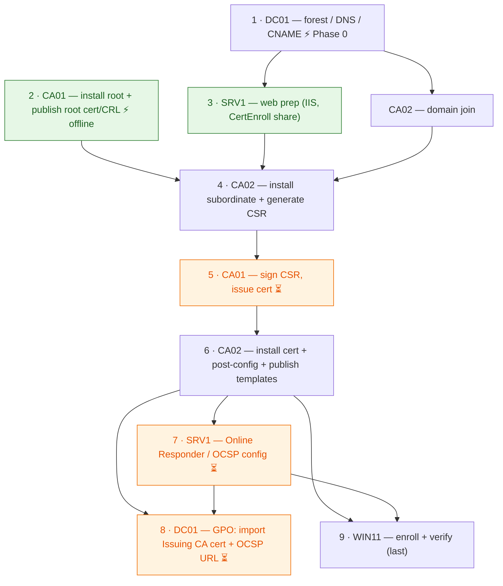

---
---

# Two-Tier PKI Hierarchy Lab — VM Summary

A Microsoft ADCS two-tier PKI lab built on the **EncryptionConsulting.com** Active
Directory forest. Five machines are involved. The hierarchy is:

```
EncryptionConsulting Root CA   (CA01 — standalone, offline)
        └── EncryptionConsulting Issuing CA   (CA02 — enterprise, online)
                └── issues certs to clients (WIN11, SRV1, ...)
```

CDP/AIA are published to LDAP (via DC01) and HTTP (via SRV1 at `pki.EncryptionConsulting.com`).

## VM Inventory

| VM | Role | OS | IP | DNS |
|----|------|-----|-----|-----|
| **DC01** | Domain Controller + DNS, LDAP CDP/AIA | Windows Server 2025 | 192.168.1.90 | 192.168.1.90 |
| **CA01** | Standalone Offline Root CA | Windows Server 2025 | NA (not networked) | NA |
| **CA02** | Enterprise Issuing (Subordinate) CA | Windows Server 2025 | 192.168.1.92 | 192.168.1.90 |
| **SRV1** | Web Server (HTTP CDP/AIA) + Online Responder (OCSP) | Windows Server 2025 | 192.168.1.93 | 192.168.1.90 |
| **WIN11** | Client test machine | Windows 11 | 192.168.1.94 | 192.168.1.90 |

---

## Build Order & Dependencies

**Can each machine be configured independently? No.** Only the offline root (**CA01**) is
truly stand-alone. Every other machine sits in a dependency chain rooted at **DC01**, and
three machines — **DC01, CA02, SRV1** — have **deferred steps** that must wait for *other*
machines to be built first. You cannot finish any of those three in a single pass.

**Marker legend** (used throughout this doc):
- ⚡ **Parallelizable** — no PKI prerequisite; can be built alongside others.
- 🔗 **Prereq: X** — this section/step cannot begin until X is complete.
- ⏳ **Deferred step** — lives in this machine's section but is performed *late* in the
  global sequence; do **not** attempt it during the machine's initial build.

**PowerShell snippets:** most step-groups below carry a collapsible **PowerShell** block with
a copy-paste-ready equivalent of the manual steps. Each is self-contained (literal lab
values), assumes an **elevated** session, and names its target host in the summary —
e.g. *(on CA01)*. A `⏳` in the summary marks a deferred step; run it only once its
prerequisites are met. A handful of genuinely GUI-only steps instead carry a **GUI step**
note with the closest scriptable approximation.

**Dependency graph** (`→` = "must come before"):



**Recommended sequence:**
1. **DC01** — forest / DNS / CNAME. *(CA01 can be built in parallel — it's offline.)*
2. **CA01** — install root, configure, publish root cert + CRL.
3. **SRV1** — IIS + CertEnroll share/vdir (needs DC01 for the domain join + Cert Publishers).
4. **CA02** — publish root cert/CRL, install subordinate, **generate CSR**.
5. **CA01** — ⏳ sign CA02's CSR, issue the cert.
6. **CA02** — install the issued cert, finish post-config, publish templates.
7. **SRV1** ⏳ configure Online Responder + auto-enroll OCSP cert; **CA02** ⏳ add OCSP URL.
8. **DC01** — ⏳ GPO: import Issuing CA cert + OCSP URL.
9. **WIN11** — join, enroll, verify the whole chain (last).

**What can truly run in parallel:** CA01 (offline) alongside DC01; and, once DC01 is up,
SRV1's web-hosting prep alongside CA02's domain join. Everything after the CSR is serialized
by the cross-signing handshake and the template/OCSP dependencies.

---

## DC01 — Domain Controller / DNS

> ⚡ **Phase 0 — no prerequisites.** Forest, DNS, and the CNAME are the very first steps;
> everything domain-joined depends on this. (The `pki` CNAME may be created now as a dangling
> record — it only *resolves* usefully once SRV1 exists.) **Exception:** the Group Policy
> step below is ⏳ deferred.

The foundation of the forest; also serves the LDAP-based CDP/AIA.

- Install the **Active Directory Domain Services** role and promote the server to a DC,
  creating a **new forest** with root domain `EncryptionConsulting.com`.
- Set the forest functional level to **Windows Server 2016**.
- Install **AD-integrated DNS** during DC promotion (set the preferred DNS to 192.168.1.90
  after restart, replacing the loopback default).

<details markdown="1">
<summary>💻 PowerShell — Install the AD DS forest + DNS (on DC01)</summary>

```powershell
# Elevated session. WinThreshold = Windows Server 2016 forest/domain functional level.
# -InstallDns installs AD-integrated DNS as part of the promotion.
Install-WindowsFeature AD-Domain-Services -IncludeManagementTools
# NetBIOS name must be <=15 chars. "EncryptionConsulting" is 20, so set it explicitly to
# ENCRYPTIONCONSU (what the GUI auto-truncates to) — otherwise the prereq check fails.
Install-ADDSForest -DomainName "EncryptionConsulting.com" `
  -DomainNetbiosName "ENCRYPTIONCONSU" `
  -ForestMode WinThreshold -DomainMode WinThreshold `
  -InstallDns -SafeModeAdministratorPassword (Read-Host -AsSecureString -Prompt "DSRM password") -Force
# Reboots automatically — reconnect, then continue.

# After the reboot, point the NIC at the DC's own DNS (replaces the 127.0.0.1 loopback default):
Set-DnsClientServerAddress -InterfaceAlias "Ethernet" -ServerAddresses 192.168.1.90
# Tip: confirm the adapter name with Get-NetAdapter if 'Ethernet' doesn't match.
```

</details>

- Create a **CNAME `PKI`** in the forward lookup zone pointing to
  `srv1.EncryptionConsulting.com.` → gives the `pki.EncryptionConsulting.com` alias used in
  all HTTP CDP/AIA URLs. The alias resolves to the web server actually hosting the
  `CertEnroll` content (SRV1), and decouples the URLs baked into issued certs from the
  physical host so the web tier can later be moved or load-balanced without reissuing certs.

<details markdown="1">
<summary>💻 PowerShell — Create the PKI CNAME (on DC01)</summary>

```powershell
Add-DnsServerResourceRecordCName -ZoneName "EncryptionConsulting.com" `
  -Name "PKI" -HostNameAlias "srv1.EncryptionConsulting.com."
```

</details>

- ⏳ **Group Policy (Default Domain Policy):** import the Issuing CA cert into
  *Intermediate Certification Authorities* and add the OCSP URL
  `http://srv1.EncryptionConsulting.com/ocsp` to it — this lets pre-existing certs use the
  new OCSP responder without re-enrollment. (Export the cert on CA02 via
  `certutil -config "ca02...\EC-Issuing-CA" -ca.cert ...`.)
  🔗 *Prereq: CA02 installed & issuing (its cert must exist, step 6) and SRV1 OCSP responder
  live (step 7). Perform near the end — not during initial DC setup.*

<details markdown="1">
<summary>⏳ 💻 PowerShell — Export the Issuing CA cert for the GPO import (on CA02)</summary>

> **GUI step — no clean PowerShell equivalent.** Pushing a cert into a GPO's *Intermediate
> Certification Authorities* store and attaching an OCSP URL are `gpmc.msc` tasks. The snippet
> only automates the prerequisite export; do the import in the Group Policy editor.

```powershell
# PREREQUISITE (deferred): CA02 is installed & issuing (step 6) and SRV1's OCSP responder is live (step 7).
# Run on CA02 to export the Issuing CA cert; then import C:\EC-Issuing-CA.crt into the
# Default Domain Policy (Computer Config > Windows Settings > Security > Public Key Policies >
# Intermediate Certification Authorities) and add the OCSP URL on its OCSP tab.
certutil -config "ca02.EncryptionConsulting.com\EncryptionConsulting Issuing CA" -ca.cert C:\EC-Issuing-CA.crt
```

</details>

---

## CA01 — Standalone Offline Root CA

> ⚡ **Parallelizable.** Being offline, CA01 can be built entirely alongside DC01 — its only
> "dependency" is *naming*: you must have decided the domain name `EncryptionConsulting.com`
> up front, because `DSConfigDN` and the LDAP CDP/AIA URLs hard-code it (these are strings
> baked into issued certs, not live AD lookups). **Exception:** the cross-signing step at the
> bottom is ⏳ deferred until CA02 produces its CSR.

Keep it **not domain-joined and not connected to any network**. Rename the computer to `CA01`.

- Create the **CAPolicy.inf** (`C:\Windows\CAPolicy.inf`): RenewalKeyLength=2048, renewal
  validity 20 years, AlternateSignatureAlgorithm=0.
- Install **AD Certificate Services** → **Certification Authority** role only.
- Configure it as a **Standalone Root CA** (the Enterprise option is greyed out — not
  domain-joined), with a new private key and default cryptography.
- Set the CA common name to **EC-Root-CA** with a **20-year** cert validity.

<details markdown="1">
<summary>💻 PowerShell — Rename, write CAPolicy.inf, install + configure the root CA (on CA01)</summary>

```powershell
# Elevated session on the offline root. Rename first (reboots), then build the CA.
Rename-Computer -NewName "CA01" -Restart
# --- after reboot ---

# CAPolicy.inf must be ASCII (no BOM). RenewalKeyLength applies when the root cert is renewed.
@'
[Version]
Signature="$Windows NT$"
[Certsrv_Server]
RenewalKeyLength=2048
RenewalValidityPeriod=Years
RenewalValidityPeriodUnits=20
AlternateSignatureAlgorithm=0
'@ | Set-Content -Path C:\Windows\CAPolicy.inf -Encoding ASCII

Install-WindowsFeature ADCS-Cert-Authority -IncludeManagementTools

# Standalone Root CA, default cryptography (omit -KeyLength/-HashAlgorithmName to accept defaults).
# -ValidityPeriod here = the root's OWN self-signed 20-year lifetime.
Install-AdcsCertificationAuthority -CAType StandaloneRootCA `
  -CACommonName "EC-Root-CA" -ValidityPeriod Years -ValidityPeriodUnits 20 -Force
```

</details>

**Post-install configuration (certutil -setreg):**
- `CA\DSConfigDN` = `CN=Configuration,DC=EncryptionConsulting,DC=com`
- CRL: `CRLPeriodUnits 52` / `CRLPeriod "Weeks"`, `CRLDeltaPeriodUnits 0` (no delta CRLs)
- CRL overlap: `CRLOverlapPeriodUnits 12` / `CRLOverlapPeriod "Hours"`
- Issued-cert validity: `ValidityPeriodUnits 10` / `ValidityPeriod "Years"` (the Issuing CA
  cert gets a 10-year lifetime)
- Auditing: enable **Audit Object Access** (Success+Failure) in Local Security Policy and
  set `CA\AuditFilter 127` (all CA events)

<details markdown="1">
<summary>💻 PowerShell — Apply post-install CA registry settings (on CA01)</summary>

```powershell
# Elevated on CA01, then restart the CA service to apply.
certutil -setreg CA\DSConfigDN "CN=Configuration,DC=EncryptionConsulting,DC=com"
certutil -setreg CA\CRLPeriodUnits 52
certutil -setreg CA\CRLPeriod "Weeks"
certutil -setreg CA\CRLDeltaPeriodUnits 0
certutil -setreg CA\CRLOverlapPeriodUnits 12
certutil -setreg CA\CRLOverlapPeriod "Hours"
certutil -setreg CA\ValidityPeriodUnits 10
certutil -setreg CA\ValidityPeriod "Years"
certutil -setreg CA\AuditFilter 127
# Enable object-access auditing (replaces the Local Security Policy GUI step):
auditpol /set /category:"Object Access" /success:enable /failure:enable
Restart-Service CertSvc
```

</details>

**AIA** (`CA\CACertPublicationURLs`) — 3 locations:
1. `C:\Windows\system32\CertSrv\CertEnroll\%1_%3%4.crt`
2. `ldap:///CN=%7,CN=AIA,CN=Public Key Services,CN=Services,%6%11`
3. `http://pki.EncryptionConsulting.com/CertEnroll/%1_%3%4.crt`

**CDP** (`CA\CRLPublicationURLs`):
1. `C:\Windows\system32\CertSrv\CertEnroll\%3%8%9.crl`
2. `ldap:///CN=%7%8,CN=%2,CN=CDP,CN=Public Key Services,CN=Services,%6%10`
3. `http://pki.EncryptionConsulting.com/CertEnroll/%3%8%9.crl`

Then run `net stop/start certsvc` and `certutil -crl` to publish.

<details markdown="1">
<summary>💻 PowerShell — Set AIA + CDP publication URLs and publish the CRL (on CA01)</summary>

```powershell
# -setreg overwrites each whole URL array — safe to re-run.
# Flag prefixes — AIA: 1=publish to location, 2=include in AIA extension of issued certs.
# CDP: 1=publish CRL, 2=include in CDP extension, 8=include in CRLs (so 10 = 2+8), 64=publish delta.
certutil -setreg CA\CACertPublicationURLs "1:C:\Windows\system32\CertSrv\CertEnroll\%1_%3%4.crt\n2:ldap:///CN=%7,CN=AIA,CN=Public Key Services,CN=Services,%6%11\n2:http://pki.EncryptionConsulting.com/CertEnroll/%1_%3%4.crt"
certutil -setreg CA\CRLPublicationURLs "1:C:\Windows\system32\CertSrv\CertEnroll\%3%8%9.crl\n10:ldap:///CN=%7%8,CN=%2,CN=CDP,CN=Public Key Services,CN=Services,%6%10\n2:http://pki.EncryptionConsulting.com/CertEnroll/%3%8%9.crl"
Restart-Service CertSvc   # modern equivalent of "net stop/start certsvc"
certutil -crl             # publish the first CRL
```

</details>

**Cross-CA roles performed on CA01:** ⏳ *Deferred — step 5 in the build order.*
🔗 *Prereq: CA02 has generated its CSR (`.req`) and you've carried it to CA01 on removable
media.*
- Receive the CA02 request (`certreq -submit`), issue the cert via the Certification
  Authority console (Pending Requests → Issue), and retrieve it (`certreq -retrieve`).

<details markdown="1">
<summary>⏳ 💻 PowerShell — Sign CA02's request and retrieve the issued cert (on CA01)</summary>

```powershell
# PREREQUISITE (deferred, step 5): CA02 has generated CA02.req and you've carried it to CA01.
# Adjust C:\Transfer to your removable-media path.
# 1) Submit the request:
certreq -submit -config "CA01\EC-Root-CA" C:\Transfer\CA02.req
# capture the RequestId printed above
# 2) Issue it (scriptable equivalent of the console "Pending Requests > Issue"):
certutil -resubmit <RequestId>
# 3) Retrieve the signed cert to carry back to CA02:
certreq -retrieve <RequestId> C:\Transfer\CA02.crt
```

</details>

---

## CA02 — Enterprise Issuing (Subordinate) CA

> 🔗 **Prereq (to start): DC01** forest up (for domain join) **+ CA01** root cert & CRL in
> hand. Built across **two passes**: the install/CSR pass (step 4), then — after CA01 signs —
> the completion/config pass (step 6). The OCSP-URL tweak is ⏳ deferred to step 7.

Domain-joined, online CA that actually issues end-entity certificates.

- Rename the computer `CA02`, then **join the `EncryptionConsulting.com`** domain.

<details markdown="1">
<summary>💻 PowerShell — Rename + join the domain (on CA02)</summary>

```powershell
# Supply domain-admin creds when prompted.
Add-Computer -DomainName "EncryptionConsulting.com" -NewName "CA02" `
  -Credential (Get-Credential) -Restart
# Reboots automatically — reconnect, then continue.
```

</details>

- Create the **CAPolicy.inf** with a CPS policy:
  - `[PolicyStatementExtension]` Policies=InternalPolicy,
    OID=`1.2.3.4.1455.67.89.5`, URL=`http://pki.EncryptionConsulting.com/cps.txt`
  - RenewalKeyLength=2048, renewal validity 10 years, **LoadDefaultTemplates=0**
    (no default templates installed), AlternateSignatureAlgorithm=0.

<details markdown="1">
<summary>💻 PowerShell — Write CAPolicy.inf with the CPS policy (on CA02)</summary>

```powershell
# ASCII (no BOM). LoadDefaultTemplates=0 leaves the issuing CA's template list empty until you publish.
@'
[Version]
Signature="$Windows NT$"
[PolicyStatementExtension]
Policies=InternalPolicy
[InternalPolicy]
OID=1.2.3.4.1455.67.89.5
URL=http://pki.EncryptionConsulting.com/cps.txt
[Certsrv_Server]
RenewalKeyLength=2048
RenewalValidityPeriod=Years
RenewalValidityPeriodUnits=10
LoadDefaultTemplates=0
AlternateSignatureAlgorithm=0
'@ | Set-Content -Path C:\Windows\CAPolicy.inf -Encoding ASCII
```

</details>

- **Publish the Root CA cert + CRL** (copy them from CA01 on removable media first)
  🔗 *Prereq: CA01 produced & published its root cert + CRL (step 2); DC01 reachable for
  `dspublish`; SRV1's `C:\CertEnroll` share already exists as the HTTP copy target:*
  - To AD: run `certutil -f -dspublish "...Root CA.crt" RootCA` and
    `certutil -f -dspublish "...Root CA.crl" CA01`
  - To the HTTP location: copy to `\\SRV1...\C$\CertEnroll\`
  - To the local store: run `certutil -addstore -f root ...`

<details markdown="1">
<summary>💻 PowerShell — Publish the root cert + CRL to AD, HTTP, and local store (on CA02)</summary>

```powershell
# PREREQUISITE: the root cert + CRL were carried from CA01 to C:\Transfer.
# Run as Enterprise Admin — dspublish writes to the AD Configuration partition (Public Key
# Services). SRV1's C:\CertEnroll share must already exist.
certutil -f -dspublish "C:\Transfer\EC-Root-CA.crt" RootCA
certutil -f -dspublish "C:\Transfer\EC-Root-CA.crl" CA01
Copy-Item "C:\Transfer\EC-Root-CA.crt" "\\SRV1\C$\CertEnroll\"
Copy-Item "C:\Transfer\EC-Root-CA.crl" "\\SRV1\C$\CertEnroll\"
certutil -addstore -f root "C:\Transfer\EC-Root-CA.crt"
```

</details>

- Install **AD CS** with the **Certification Authority + CA Web Enrollment** role services.
- Configure it as an **Enterprise Subordinate CA** with a new private key and common name
  **EncryptionConsulting Issuing CA**. Save the cert request to file → sign it on CA01 →
  install the issued cert (**Install CA Certificate**) and start the service.
  🔗 *The "signed by CA01 → installed" half cannot proceed until CA01's deferred signing step
  (step 5) returns the issued `.crt`.*

<details markdown="1">
<summary>💻 PowerShell — Install role + configure the subordinate CA, generate the CSR (on CA02)</summary>

```powershell
Install-WindowsFeature ADCS-Cert-Authority, ADCS-Web-Enrollment -IncludeManagementTools

# Run as Enterprise Admin — an Enterprise CA registers itself in AD (the GUI greys out the
# "Enterprise" setup type without those rights). Default cryptography (omit -KeyLength/-HashAlgorithmName).
# Writes the CSR to file. Expect a warning that the CA is installed but NOT started — normal; it awaits the signed cert.
Install-AdcsCertificationAuthority -CAType EnterpriseSubordinateCA `
  -CACommonName "EncryptionConsulting Issuing CA" `
  -OutputCertRequestFile "C:\EncryptionConsulting-Issuing-CA.req" -Force
# Carry the .req to CA01 for signing (step 5).
```

</details>

<details markdown="1">
<summary>⏳ 💻 PowerShell — Install the signed cert + start the service (on CA02)</summary>

```powershell
# PREREQUISITE (deferred, step 6): CA01 has signed the request; CA02.crt is back on C:\Transfer.
certutil -installcert "C:\Transfer\CA02.crt"
Start-Service CertSvc
```

</details>

**Post-install configuration (certutil -setreg):**
- CRL: `CRLPeriodUnits 1` / `"Weeks"`; Delta CRL: `CRLDeltaPeriodUnits 1` / `"Days"`
- CRL overlap: `CRLOverlapPeriodUnits 12` / `"Hours"`
- Issued-cert validity: `ValidityPeriodUnits 5` / `"Years"` (half the 10-yr CA lifetime)
- Auditing: Audit Object Access enabled + `CA\AuditFilter 127`

<details markdown="1">
<summary>💻 PowerShell — Apply post-install CA registry settings (on CA02)</summary>

```powershell
certutil -setreg CA\CRLPeriodUnits 1
certutil -setreg CA\CRLPeriod "Weeks"
certutil -setreg CA\CRLDeltaPeriodUnits 1
certutil -setreg CA\CRLDeltaPeriod "Days"
certutil -setreg CA\CRLOverlapPeriodUnits 12
certutil -setreg CA\CRLOverlapPeriod "Hours"
certutil -setreg CA\ValidityPeriodUnits 5
certutil -setreg CA\ValidityPeriod "Years"
certutil -setreg CA\AuditFilter 127
auditpol /set /category:"Object Access" /success:enable /failure:enable
Restart-Service CertSvc
```

</details>

**AIA** — same 3 locations as the root (file / LDAP / HTTP); also copy the Issuing CA
cert to SRV1's HTTP location. Later, **add the OCSP URL**
`http://srv1.EncryptionConsulting.com/ocsp` to the AIA extension with *"Include in the
OCSP extension"* checked (only that box).

<details markdown="1">
<summary>💻 PowerShell — Set AIA URLs + copy the Issuing CA cert to SRV1 (on CA02)</summary>

```powershell
# AIA — 3 locations (file / LDAP / HTTP). -setreg overwrites the whole array — safe to re-run.
certutil -setreg CA\CACertPublicationURLs "1:C:\Windows\system32\CertSrv\CertEnroll\%1_%3%4.crt\n2:ldap:///CN=%7,CN=AIA,CN=Public Key Services,CN=Services,%6%11\n2:http://pki.EncryptionConsulting.com/CertEnroll/%1_%3%4.crt"
Restart-Service CertSvc
# Copy the Issuing CA cert to SRV1's HTTP location:
Copy-Item "C:\Windows\System32\CertSrv\CertEnroll\*.crt" "\\SRV1\C$\CertEnroll\"
```

</details>

<details markdown="1">
<summary>⏳ 💻 PowerShell — Add the OCSP URL to the AIA extension (on CA02)</summary>

```powershell
# PREREQUISITE (deferred, step 7): done as part of standing up SRV1's OCSP responder.
# -AddToCertificateOcsp == the GUI "Include in the OCSP extension" box, and ONLY that box.
Add-CAAuthorityInformationAccess -Uri "http://srv1.EncryptionConsulting.com/ocsp" -AddToCertificateOcsp -Force
Restart-Service CertSvc
```

</details>

**CDP** (`CA\CRLPublicationURLs`) — 4 locations:
1. `C:\Windows\system32\CertSrv\CertEnroll\%3%8%9.crl`
2. `ldap:///CN=%7%8,CN=%2,CN=CDP,CN=Public Key Services,CN=Services,%6%10`
3. `http://pki.EncryptionConsulting.com/CertEnroll/%3%8%9.crl`
4. `\\srv1.EncryptionConsulting.com\CertEnroll\%3%8%9.crl`

<details markdown="1">
<summary>💻 PowerShell — Set the 4 CDP URLs and publish the CRL (on CA02)</summary>

```powershell
# CDP — 4 locations (file / LDAP / HTTP / UNC share on SRV1). -setreg overwrites the whole array.
# Issuing-CA flag masks: 65 = publish CRL + publish delta (file & UNC); 79 = full LDAP set;
# 6 = include-in-CDP + find-delta (HTTP, not a publish target).
certutil -setreg CA\CRLPublicationURLs "65:C:\Windows\system32\CertSrv\CertEnroll\%3%8%9.crl\n79:ldap:///CN=%7%8,CN=%2,CN=CDP,CN=Public Key Services,CN=Services,%6%10\n6:http://pki.EncryptionConsulting.com/CertEnroll/%3%8%9.crl\n65:\\srv1.EncryptionConsulting.com\CertEnroll\%3%8%9.crl"
Restart-Service CertSvc
certutil -crl
```

</details>

**Publish certificate templates:** 🔗 *Prereq: CA02 service running (step 6); these are
what unblock SRV1's OCSP cert and WIN11's client cert downstream.*
- **OCSP Response Signing** — grant SRV1's computer account Read+Enroll, then publish it so
  SRV1 can auto-enroll its OCSP signing cert.
- **Workstation Authentication** — publish it so domain clients (WIN11) can enroll.

<details markdown="1">
<summary>💻 PowerShell — Publish the OCSP + Workstation templates (on CA02)</summary>

> **GUI step (ACL) — no clean PowerShell equivalent without PSPKI.** Granting SRV1's computer
> account Read+Enroll on the *OCSP Response Signing* template is an AD ACL edit — do it in
> `certtmpl.msc` (template → Properties → Security → add the SRV1 computer → Read + Enroll).
> The publish action itself is scriptable below.

```powershell
# Add-CATemplate uses the template's CN (internal) name, not the display name:
#   "OCSPResponseSigning" -> display "OCSP Response Signing"
#   "Workstation"         -> display "Workstation Authentication"
Add-CATemplate -Name "OCSPResponseSigning" -Force
Add-CATemplate -Name "Workstation" -Force
```

</details>

---

## SRV1 — Web Server + Online Responder (OCSP)

> 🔗 **Prereq (to start): DC01** forest up (for domain join + the Cert Publishers group).
> Built in **two passes**: the **web-hosting prep** (⚡ can run alongside CA02's domain join,
> step 3) — and note `C:\CertEnroll` must exist *before* CA02 publishes the root cert to it.
> The **Online Responder / OCSP** half is ⏳ deferred until CA02 is issuing (step 7).

Hosts the HTTP CDP/AIA distribution point and the OCSP responder.

- Join SRV1 to the `EncryptionConsulting.com` domain.

<details markdown="1">
<summary>💻 PowerShell — Rename + join the domain (on SRV1)</summary>

```powershell
Add-Computer -DomainName "EncryptionConsulting.com" -NewName "SRV1" `
  -Credential (Get-Credential) -Restart
# Reboots automatically — reconnect, then continue.
```

</details>

- Install the **Web Server (IIS)** role (default role services).
- Create the `C:\CertEnroll` folder, share it, and grant the **Cert Publishers** group
  *Change* (share) and *Modify* (NTFS) permissions.
- Create a **CertEnroll virtual directory** in IIS (Default Web Site → alias `CertEnroll`,
  path `C:\CertEnroll`) and **enable Directory Browsing**.
- **Enable double-escaping** in IIS request filtering
  (`appcmd ... -allowDoubleEscaping:True` + `iisreset`) so it can host **Delta CRLs**.

<details markdown="1">
<summary>💻 PowerShell — IIS + CertEnroll share, vdir, and double-escaping (on SRV1)</summary>

```powershell
Install-WindowsFeature Web-Server -IncludeManagementTools

# Folder + SMB share (Change for Cert Publishers) + NTFS Modify.
# Down-level account names need the NetBIOS domain (ENCRYPTIONCONSU), not the DNS label
# "EncryptionConsulting" — the GUI picker resolves a bare "Cert Publishers", PowerShell won't.
New-Item -Path C:\CertEnroll -ItemType Directory -Force | Out-Null
New-SmbShare -Name "CertEnroll" -Path C:\CertEnroll -ChangeAccess "ENCRYPTIONCONSU\Cert Publishers"
icacls C:\CertEnroll /grant "ENCRYPTIONCONSU\Cert Publishers:(OI)(CI)M"

# Virtual directory + directory browsing:
Import-Module WebAdministration
New-WebVirtualDirectory -Site "Default Web Site" -Name "CertEnroll" -PhysicalPath "C:\CertEnroll"
Set-WebConfigurationProperty -PSPath "IIS:\Sites\Default Web Site\CertEnroll" `
  -Filter "/system.webServer/directoryBrowse" -Name enabled -Value $true

# Allow double-escaping so the site can serve Delta CRLs:
Set-WebConfigurationProperty -PSPath "IIS:\Sites\Default Web Site" `
  -Filter "/system.webServer/security/requestFiltering" -Name allowDoubleEscaping -Value $true
iisreset
```

</details>

- Install the **AD CS → Online Responder** role service only (clear Certification Authority).

<details markdown="1">
<summary>💻 PowerShell — Install the Online Responder role (on SRV1)</summary>

```powershell
# Online Responder only — no Certification Authority on SRV1.
Install-WindowsFeature ADCS-Online-Cert -IncludeManagementTools
Install-AdcsOnlineResponder -Force
```

</details>

- ⏳ **Add a Revocation Configuration** (Online Responder Management):
  🔗 *Prereq: CA02 installed & issuing — it points at the "existing enterprise CA" (CA02).*
  - Name it *EC-Issuing-CA*; take the cert from the existing enterprise CA.
  - Disable *Refresh CRLs by validity period*; set the manual refresh interval to **15 min**.
  - Verify the status shows OK under Array Configuration → SRV1.

<details markdown="1">
<summary>⏳ 💻 PowerShell — Add the OCSP revocation configuration (on SRV1)</summary>

> **GUI step — no clean PowerShell equivalent.** There are no first-class cmdlets for an OCSP
> revocation configuration; use `ocsp.msc` (Online Responder Management) as described above.
> The commented `CertAdm.OCSPAdmin` COM skeleton below is advanced and **not** copy-paste-ready
> — verify every property first.

```powershell
# PREREQUISITE (deferred, step 7): CA02 is installed & issuing.
# Recommended path — ocsp.msc: Add Revocation Configuration named "EC-Issuing-CA", select the
# existing enterprise CA, clear "Refresh CRLs based on their validity periods", set 15-min refresh.
#
# Advanced/best-effort via COM (skeleton only — set each property, then SetConfiguration):
# $ocsp = New-Object -ComObject "CertAdm.OCSPAdmin"
# $ocsp.GetConfiguration($env:COMPUTERNAME, $true)
# $cfg = $ocsp.OCSPCAConfigurationCollection.CreateCAConfiguration("EC-Issuing-CA", $caCertBytes)
# ...set HashAlgorithm / SigningFlags / CRL URLs / SigningCertificateTemplate / refresh interval...
# $ocsp.SetConfiguration($env:COMPUTERNAME, $true)
```

</details>

- ⏳ Auto-enroll the **OCSP Response Signing** certificate.
  🔗 *Prereq: CA02 published the OCSP Response Signing template and granted SRV1 Read+Enroll
  (step 6).*

<details markdown="1">
<summary>⏳ 💻 PowerShell — Enroll the OCSP signing certificate (on SRV1)</summary>

```powershell
# PREREQUISITE (deferred, step 7): CA02 published OCSP Response Signing AND granted SRV1 Read+Enroll.
# The responder usually pulls its signing cert automatically; to enroll it manually:
Get-Certificate -Template "OCSPResponseSigning" -CertStoreLocation Cert:\LocalMachine\My
```

</details>

---

## WIN11 — Client / Verification Machine

> 🔗 **Prereq: the entire hierarchy — this is the last machine (step 9).** Needs DC01 (join)
> + CA02 issuing + the Workstation Authentication template (step 6); verification additionally
> needs the full chain reachable: CA01 root cert published, SRV1 HTTP CDP/AIA live, and SRV1
> OCSP responder live (step 7).

Used to prove the hierarchy works end to end.

- Rename the computer `WIN11` and join the `EncryptionConsulting.com` domain.

<details markdown="1">
<summary>💻 PowerShell — Rename + join the domain (on WIN11)</summary>

```powershell
Add-Computer -DomainName "EncryptionConsulting.com" -NewName "WIN11" `
  -Credential (Get-Credential) -Restart
# Reboots automatically — reconnect, then continue.
```

</details>

- Enroll a **Workstation Authentication** certificate via the Certificates (Computer
  Account) MMC snap-in.
- Export the cert to `C:\win11.cer` (no private key, DER) and verify the PKI:
  - Run `certutil -URL C:\win11.cer` → confirm **OCSP (from AIA)**, **CRLs (from CDP)**, and
    **Certs (from AIA)** all show **Verified**.
  - Run `certutil -verify -urlfetch c:\win11.cer` → full chain + revocation verification.

<details markdown="1">
<summary>💻 PowerShell — Enroll, export, and verify the client cert (on WIN11)</summary>

> Note: `certutil -URL` is an interactive GUI tool and cannot be scripted; the
> non-interactive `certutil -verify -urlfetch` below performs the same chain + revocation check.

```powershell
# Enroll a Workstation Authentication cert into the machine store.
# -Template wants the template's CN (internal) name, not the display name shown in the GUI:
#   "Workstation" = display "Workstation Authentication" (matches Add-CATemplate on CA02).
Get-Certificate -Template "Workstation" -CertStoreLocation Cert:\LocalMachine\My

# Export it (DER, no private key) to match the doc:
$cert = Get-ChildItem Cert:\LocalMachine\My |
  Where-Object { $_.EnhancedKeyUsageList.FriendlyName -contains "Client Authentication" } |
  Select-Object -First 1
Export-Certificate -Cert $cert -FilePath C:\win11.cer -Type CERT

# Verify the full chain + CRL/OCSP revocation (prints the "Verified" lines):
certutil -verify -urlfetch C:\win11.cer
```

</details>

---

## Health Verification (run from CA02)

> 🔗 **Prereq: every machine built and every deferred step complete.** This is the final
> sign-off after step 9.

Using **Enterprise PKI / PKIView.msc**, all containers should show status **OK**:
- **NTAuthCertificates** — Issuing CA present
- **AIA Container** — both Root CA and Issuing CA certs present
- **CDP Container** — Root CA base CRL, Issuing CA base CRL, and Delta CRLs present
- **Certification Authorities Container** — Root CA cert present
- **Enrollment Services Container** — Issuing CA cert present

<details markdown="1">
<summary>💻 PowerShell — Best-effort health checks (on CA02)</summary>

> **GUI step (inspect-only) — no PKIView cmdlet.** `pkiview.msc` (Enterprise PKI) is a visual
> health console with no native cmdlet. The commands below are the closest scriptable proxies.

```powershell
# Full chain build + CRL/OCSP revocation health (run against any issued cert):
certutil -verify -urlfetch C:\win11.cer
# Inspect the NTAuthCertificates container (opens the store viewer):
certutil -viewstore -enterprise NTAuth
```

</details>
